|                           微信群                           |                           公众号                            |
|:-----------------------------------------------------:|:------------------------------------------------------:|
|   |   |

<div align="center">
无论是不是与此产品有关的话题，都很高兴你能加入群聊吃瓜聊天，<br/>
加群前请一定要Star。关注公众号，获取AnyClient最新动态。<br/>
（加群前请一定要Star！！！ ）
</div>

<p align="center">
	<a href="https://www.clientbiz.cn"></a>
</p>
<h1 align="center">AnyClient IDE </h1>

<div align="center">

如果觉得 AnyClient 对您有帮助的话，请帮忙在
<a target="_blank" href='https://gitee.com/hanbingzi/anyclient-ide'>
gitee</a>或
<a target="_blank" href='https://github.com/hanbingzi/anyclient-ide'>
github</a>
平台上面的右上角点个⭐ Star ，您的支持是 AnyClient 开源的最大的动力
</div>

[Demo演示地址](http://111.67.201.184:8080/?workspaceDir=/app/workspace)

[官网地址](https://www.clientbiz.cn)

[AnyClient Web 版本请移步此处（源码地址）](https://github.com/hanbingzi/anyclient-web)


[GitHub主页地址](https://github.com/hanbingzi)


[Gitee主页地址](https://gitee.com/hanbingzi)

AnyClient是一款开源的，支持WEB、Dokcer、客户端版本，能够连接各种类型的关系数据库、非关系型数据库、时序数据库、图数据库、消息队列、注册中心等数据服务的管理软件，支持Mac和Windows平台安装部署。

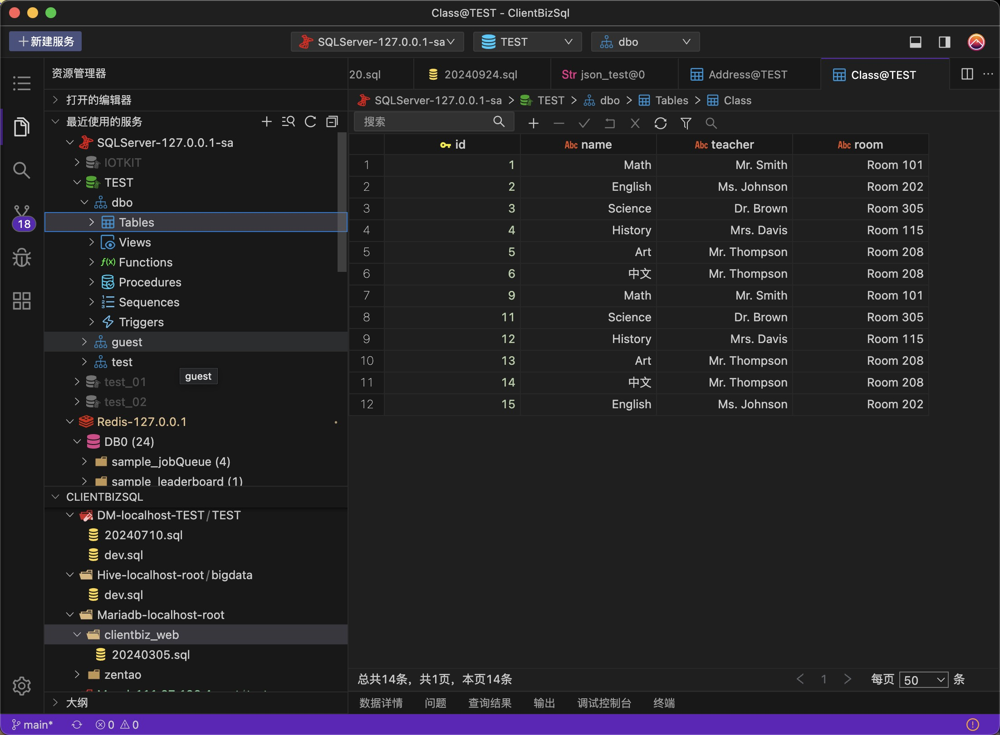

<h2 align="center">AnyClient当前支持的客户端 </h2>

|                        -                        |                       -                        |                        -                         |                     -                      |                       -                        |                   -                    |
|:-----------------------------------------------:|:----------------------------------------------:|:------------------------------------------------:|:------------------------------------------:|:----------------------------------------------:|:--------------------------------------:|
|           |   |          |  |  |  |
|                      Mysql                      |                   Postgresql                   |                      Oracle                      |                  Mariadb                   |                   SqlServer                    |                 Redis                  |
| |  |          |                  |        |  |                                        
|                  Elasticsearch                  |                             Zookeeper          |                      Kafka                      |                        达梦                        |                    TiDB                    |                   oceanbase                    |                                       
|             |    |  |    |          |      |
|                      Etcd                       |                    TDEngine                    |                    ClickHouse                    |                   Presto                   |                     Trino                      |                  DB2                   |

<h2 align="center">AnyClient下一步将要支持的客户端 </h2>

|                        -                         |                      -                       |                     -                      |                   -                    |                  -                  |                    -                     |
|:------------------------------------------------:|:--------------------------------------------:|:------------------------------------------:|:--------------------------------------:|:-----------------------------------:|:----------------------------------------:|
|  |  |   |  |  ||
|                   Influxdb                   |                  MongoDB                   |                  Emq                   |                人大金仓                 |                  Sqlite                  |Hive  |
|      |                                        |                                     ||
|                   Neo4j                    |                                        |                                     | |                                          |


## 一：功能特点

- **开源免费**
- **安装包、WEB、Docker方式安装使用**
- **丰富的表数据编辑，表结构修改编辑、SQL编辑器，执行SQL查询和脚本等**
- **方便的Git管理SQL及其他语言脚本**
- **丰富的第三方客户端支持**
- **优秀的智能脚本语言提示**
- **基于OpenSumi二次魔改，支持VSCODE插件**

## 二：AnyClient功能截图

### 安装包、WEB、Docker方式安装使用

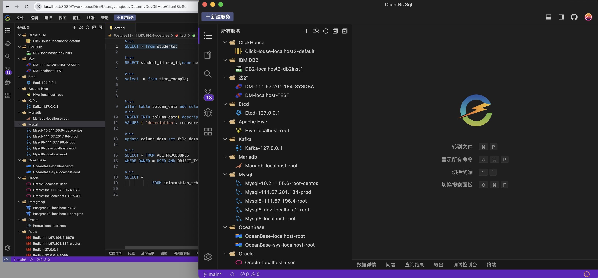

### 多种主题切换

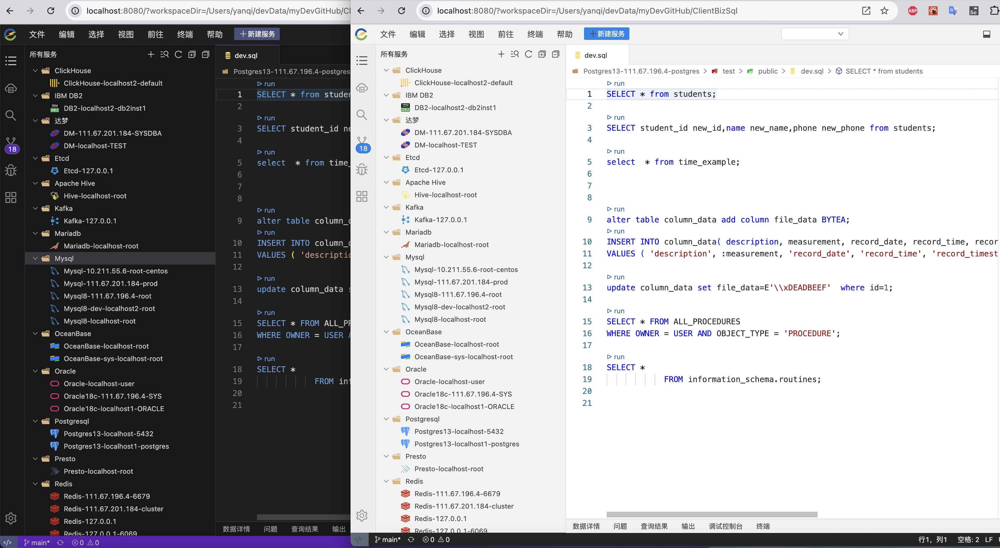

### 使用GIT管理脚本


## 三：AnyClient客户端功能

### 1.数据库支持功能

包括：Mysql，Oracle，Postgresql，Mariadb，SqlServer，达梦，TiDB，OceanBase，DB2，ClickHouse，Presto，Trino，TDEngine

```bash
├── 数据库  
│   └── 右键
│       ├── 新建库
│       ├── 删除库
│       ├── 刷新
│       └── 关闭连接              
├── 表   
│   ├── 右键
│   │   ├── 重命名
│   │   ├── 编辑表结构
│   │   ├── 清空表数据
│   │   ├── 删除表
│   │   ├── 复制表创建SQL
│   │   └── 复制表查询语句
│   ├── 表查询
│   │   ├── 条件查询
│   │   ├── 翻页
│   │   ├── 删除一条或多条
│   │   ├── 修改一条或多条
│   │   └── 选中一行右键
│   │       ├── 删除记录
│   │       ├── 上方插入行
│   │       ├── 下方插入行
│   │       ├── 复制行
│   │       ├── 粘贴行
│   │       ├── 复制为insert语句
│   │       ├── 复制为update语句
│   │       └── 复制为delete语句
│   ├── 表新建
│   │   ├── 字段名称
│   │   ├── 字段类型
│   │   ├── 字段长度
│   │   ├── 字段精度
│   │   ├── 字段是否为空
│   │   ├── 字段默认值
│   │   ├── 字段主键
│   │   └── 字段注释
│   │  
│   └── 表编辑
│       ├── 修改字段名称
│       ├── 修改字段类型
│       ├── 修改字段长度
│       ├── 修改字段精度
│       ├── 修改字段是否为空
│       ├── 修改字段默认值
│       ├── 修改字段主键
│       └── 修改字段注释                  
├── 视图
│   ├── 查询
│   ├── 删除
│   └── 复制创建sql
├── 函数
│   ├── 查询详情
│   ├── 删除
│   └── 查看创建sql
├── 存储过程
│   ├── 查询详情
│   ├── 删除
│   └── 查看创建sql
└── 触发器
    ├── 查询详情
    ├── 删除
    └── 查看创建sql
```

#### Mysql数据查询


#### sql 智能补充

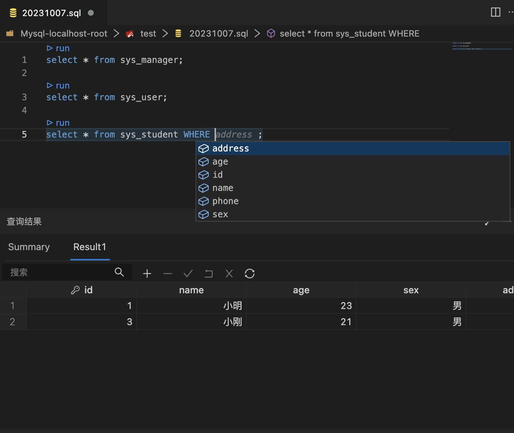

### 2.Redis支持功能

```bash
├── 展示
│   ├── 库
│   ├── key
│       ├── string
│       │   ├── Text 
│       │   ├── Json
│       │   ├── Hex
│       │   ├── Binary
│       │   ├── MsgPack
│       │   ├── Java Serialized
│       │   ├── Java Serialized
│       │   └── Java Serialized
│       ├── hash
│       ├── set
│       ├── zset
│       └── list                  
├── 数据编辑
│       ├── string
│       │   ├── Text 
│       │   ├── Json
│       │   ├── Hex
│       │   ├── Binary
│       │   ├── MsgPack
│       │   ├── Java Serialized
│       │   ├── Java Serialized
│       │   └── Java Serialized
│       ├── hash（新增、删除、修改）
│       ├── set（新增、删除、修改）
│       ├── zset（新增、删除、修改）
│       └── list （新增、删除、修改）                    

```

#### Redis操作主界面

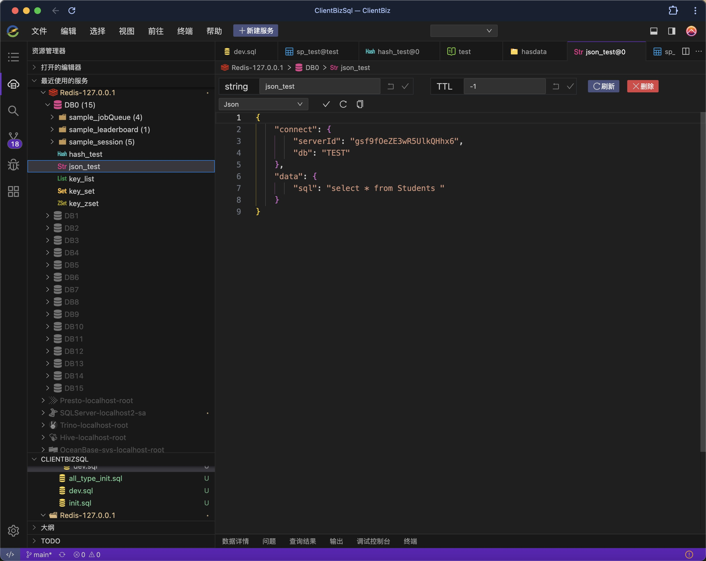

### 3.Elasticsearch支持功能
#### Elasticsearch首页
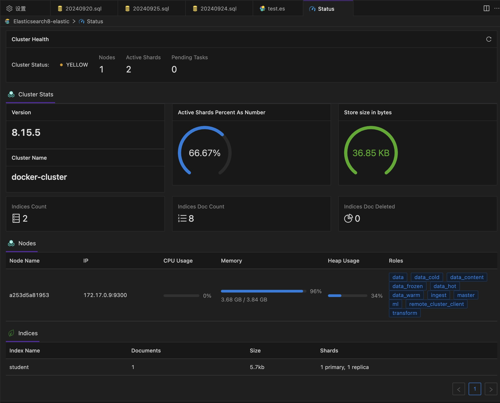
#### Elasticsearch index数据查询
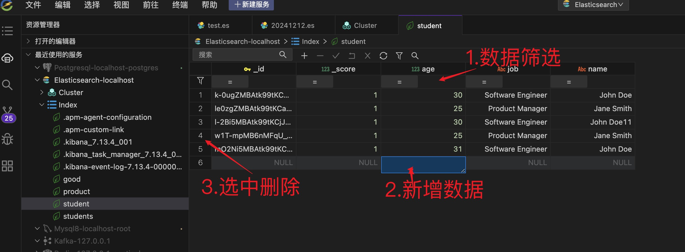
#### Elasticsearch 脚本
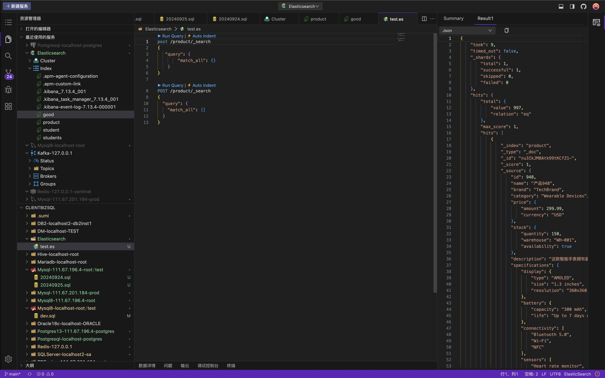

### 4.Zookeeper支持功能

1. 新增key
2. 删除key
3. 修改key

#### Zookeeper操作主界面

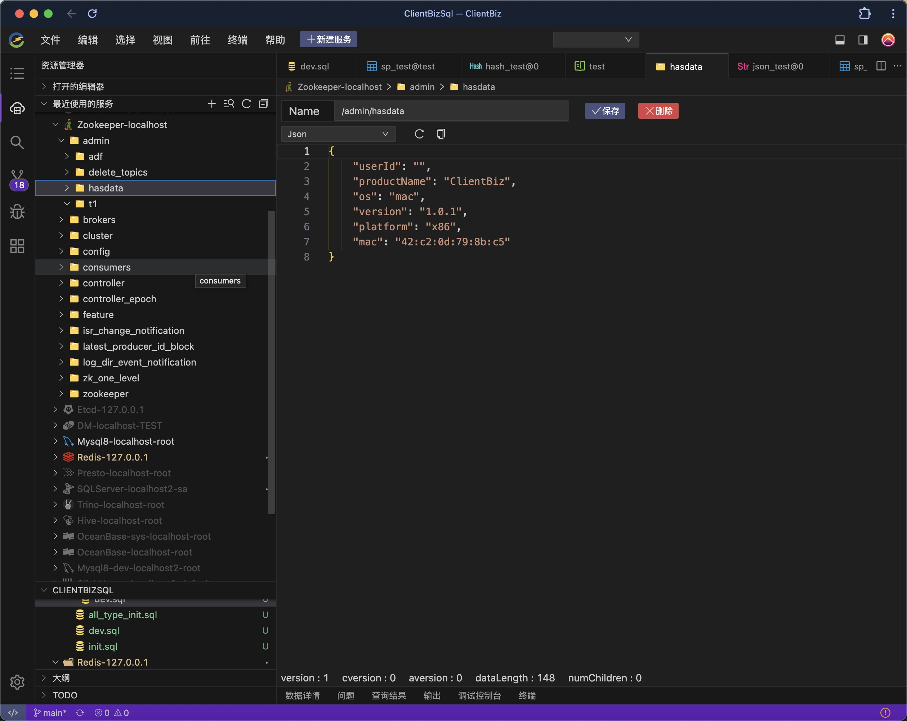

### 5.Kafka支持功能

1. 消息
    - 查询消息
    - 新增消息
2. topic
    - 新建topic
3. Broker查看
4. Group查看

#### kafka状态监控页

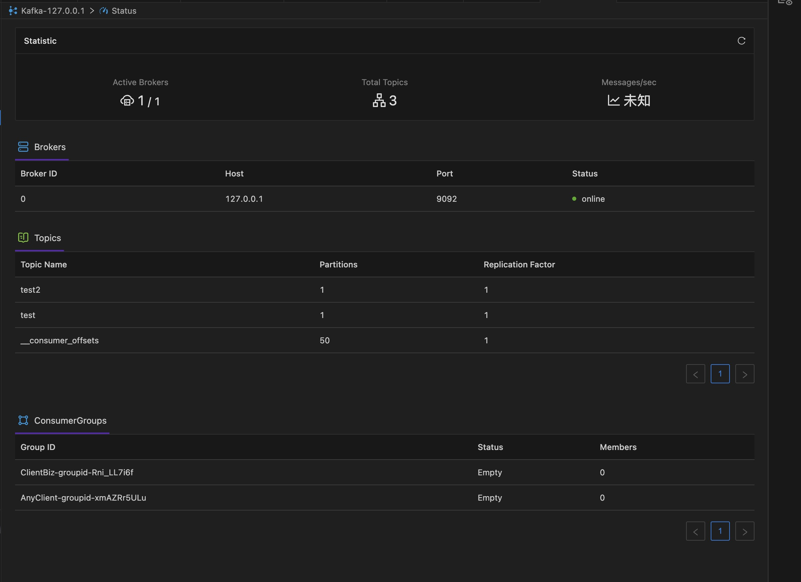

#### Kafka操作主界面

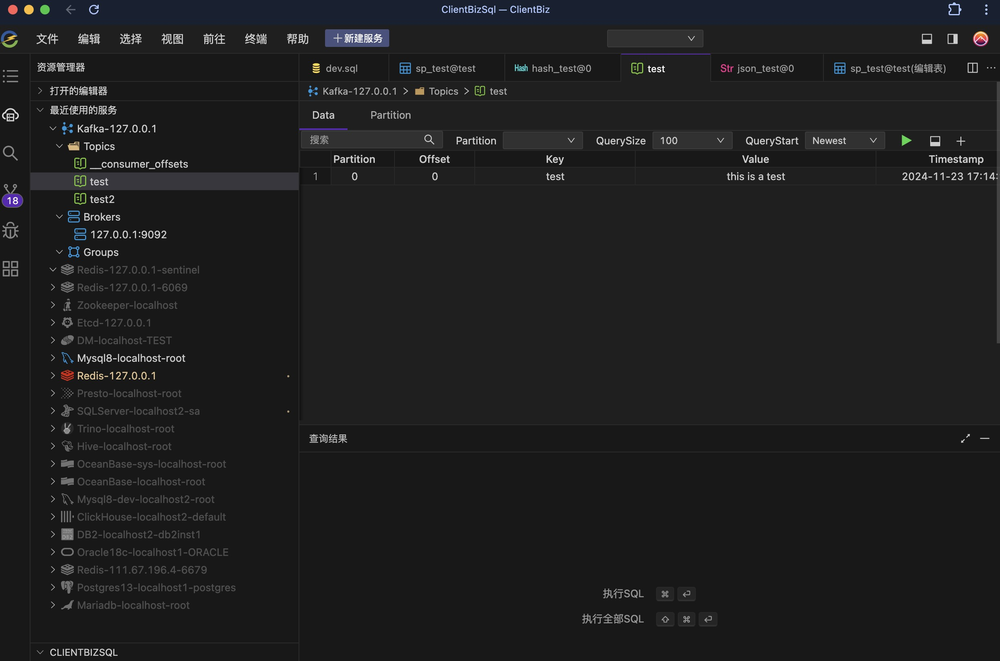

### 5.Etcd支持功能

1. Data

- 查询
- 修改
- 删除
- 新增

2. Security

- 用户
    - 新增
    - 删除
- 角色
    - 新增
    - 删除

3. Cluster查询

#### Etcd操作主界面

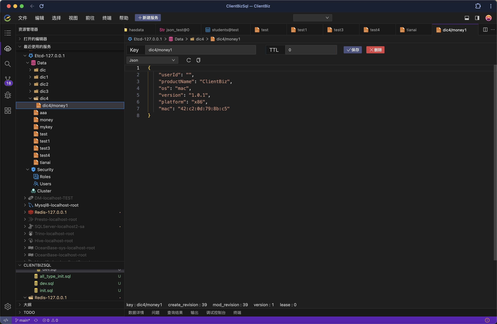

## 四：Mac安装报错

### mac 首次安装会报如下错误：


### 解决办法
1. 打开终端，输入命令：
```
xattr -cr
```
2. 打开应用程序目录，拖动安装好的App到终端并按下回车键。
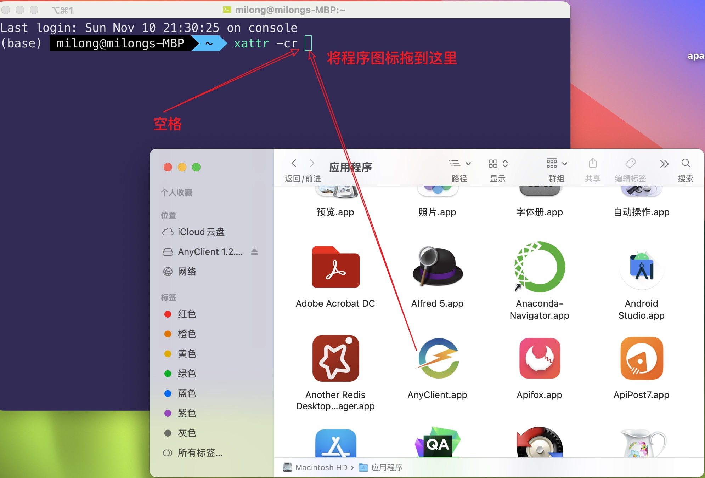

如果不能解决以上问题，可以参考：https://mbd.baidu.com/newspage/data/dtlandingsuper?nid=dt_4455544948389474091


## 五：运行代码

```bash
$ git clone https://github.com/hanbingzi/anyclient-ide.git
$ cd anyclient-ide
$ yarn
$ yarn build
$ yarn rebuild-native --force-rebuild=true
$ yarn start
```

## 特别感谢

开发一个好用的工具，并维护和营销的过程是艰难的，需要志同道合的朋友共同努力，如下是对本项目代码有贡献的同志，特此感谢：

|<a href="https://gitee.com/reminderlife">cabin</a>|        <a href="https://gitee.com/yulupaopao ">子龙</a>        | <a href="https://gitee.com/yulupaopao ">开着拖拉机唱山歌🚜</a> |
|:-------------------------------------------------:|:------------------------------------------------------------:|:------------------------------------------------------:|
|  |           |      |


## 商务联系

- 作者邮箱：hanbingzi@aliyun.com
- 关注公众号，加作者好友。

## 最后


## License

AGPL-3.0

本软件遵循AGPL-3.0协议，请勿用于该协议之外的用途。如果发现未经允许的商业化用途，一定会进行相应的起诉。

如果你想将本软件的代码用于闭源的商业代码，需要解除GPL系列的开源限制，请通过微信或邮箱咨询我，了解商业授权相关事宜


